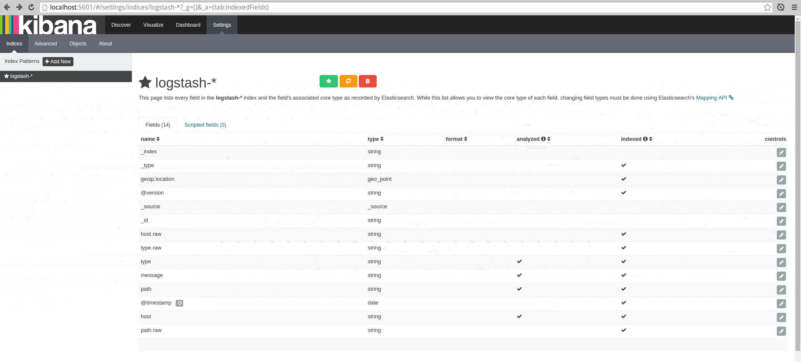

## Overview

In this example we'll look at a quick start 'how to' with Docker.

In just a few commands and configuration files we'll have an ELK stack up and running.

## Method

The following method has been tested, and is being used, with Linux Ubuntu 14.04.

**Installation**

**Install Docker**

If you don't have docker installed already, go ahead and install it.

You can find instructions for your computer at the [Official installation docs](https://docs.docker.com/installation/)

**Note**: Once you have docker installed, we'll be using the command line for all install and setup steps below.

You will need to open a new shell window and type or copy and paste the following commands:

**Install Elasticsearch**

- Download the [Offical Elasticsearch Docker image](https://hub.docker.com/_/elasticsearch/).
- `sudo docker pull elasticsearch`

**Install Logstash**

- Download the [Official Logstash Docker image](https://hub.docker.com/_/logstash/).
- `sudo docker pull logstash`

**Install Kibana**

- Download the [Official Kibana 4 Docker image](https://hub.docker.com/_/kibana/).
- `sudo docker pull kibana`

### Test Installation

**Elasticsearch**

- Create a directory to hold the persisted index data.
- `mkdir esdata`
- Run a Docker container, bind the esdata directory (volume) and expose port 9200.
- `sudo docker run -d --name elasticsearch -v "$PWD/esdata":/usr/share/elasticsearch/data -p 9200:9200 elasticsearch`
- You should see some output like:
- `f624c4ea0f532b8022d948befdb81299e08c57e3e3e50c75976f66366ec423a8`
- Check the container is running OK:
- `sudo docker ps`
- You should see output similar to:

```
CONTAINER ID        IMAGE               COMMAND                CREATED             STATUS              PORTS                NAMES
81acb79909b2        elasticsearch       "/docker-entrypoint.   4 seconds ago       Up 4 seconds        0.0.0.0:9200->9200/tcp, 9300/tcp   elasticsearch
```

- We can also look at the start up output from the elasticsearch container.
- `sudo docker logs elasticsearch`

You should see output like:

```
[2015-10-04 01:30:24,859][INFO ][node                     ] [Darkoth] version[1.7.2], pid[1], build[e43676b/2015-09-14T09:49:53Z]
[2015-10-04 01:30:24,860][INFO ][node                     ] [Darkoth] initializing ...
[2015-10-04 01:30:24,901][INFO ][plugins                  ] [Darkoth] loaded [], sites []
[2015-10-04 01:30:24,924][INFO ][env                      ] [Darkoth] using [1] data paths, mounts [[/usr/share/elasticsearch/data (/dev/mapper/crypt2)]], net usable_space [101.5gb], net total_space [114gb], types [ext4]
[2015-10-04 01:30:26,507][INFO ][node                     ] [Darkoth] initialized
[2015-10-04 01:30:26,507][INFO ][node                     ] [Darkoth] starting ...
[2015-10-04 01:30:26,546][INFO ][transport                ] [Darkoth] bound_address {inet[/0:0:0:0:0:0:0:0:9300]}, publish_address {inet[/172.17.0.12:9300]}
[2015-10-04 01:30:26,556][INFO ][discovery                ] [Darkoth] elasticsearch/MoTbiQ-ZQ42H5KmQiSDznQ
[2015-10-04 01:30:30,320][INFO ][cluster.service          ] [Darkoth] new_master [Darkoth][MoTbiQ-ZQ42H5KmQiSDznQ][896132e24bd7][inet[/172.17.0.12:9300]], reason: zen-disco-join (elected_as_master)
[2015-10-04 01:30:30,348][INFO ][http                     ] [Darkoth] bound_address {inet[/0:0:0:0:0:0:0:0:9200]}, publish_address {inet[/172.17.0.12:9200]}
[2015-10-04 01:30:30,348][INFO ][node                     ] [Darkoth] started
[2015-10-04 01:30:30,363][INFO ][gateway                  ] [Darkoth] recovered [0] indices into cluster_state
```

Elasticsearch should now be running on port 9200. 

To test, point your browser at port 9200 [http://localhost:9200](http://localhost:9200). 

You should see output similar to the following with status code of 200. 

```
{
  "status" : 200,
  "name" : "Letha",
  "cluster_name" : "elasticsearch",
  "version" : {
    "number" : "1.7.2",
    "build_hash" : "e43676b1385b8125d647f593f7202acbd816e8ec",
    "build_timestamp" : "2015-09-14T09:49:53Z",
    "build_snapshot" : false,
    "lucene_version" : "4.10.4"
  },
  "tagline" : "You Know, for Search"
}
```

**Logstash**

- Create a directory for your logstash configuration files.
- `mkdir -p logstash/conf.d/`
- Create an **input** logstash configuration file `logstash/conf.d/input.conf` with this content:

```
input {
    file {
        type => "test"
        path => [
            "/host/var/log/test.log"
            ]
    }
}
```

- Create an **output** logstash configuration file `logstash/conf.d/output.conf` with this content:

```
output {
    elasticsearch {
        host => ["localhost"]
        protocol => "http"
    }
}
```

- For our use case here our Docker Logstash container will monitor a log file from our host machine.
- Create a directory for log files that our Logstash Docker container will monitor.
- `mkdir -p var/log`
- Start our logstash docker container. It will watch the `test.log` file from the `var/log` directory we just created.
- `sudo docker run -d --name logstash -v $PWD/logstash/conf.d:/etc/logstash/conf.d:ro -v $PWD/var/log:/host/var/log --net host logstash logstash -f /etc/logstash/conf.d --debug`
- We've used the `--debug` flag so we can check logstash's start up processes and watch for any errors:
- `sudo docker logs -f logstash`

To test your Logstash to Elasticsearch installation, run the following command in a new shell:

- `echo 101 > var/log/test.log`
- Now lets check Elasticsearch
- `curl localhost:9200/logstash-*/_search?pretty=true`
- You should see some json format output with a "_source" property with "message" 101.

```
{
  "took" : 36,
  "timed_out" : false,
  "_shards" : {
    "total" : 5,
    "successful" : 5,
    "failed" : 0
  },
  "hits" : {
    "total" : 1,
    "max_score" : 1.0,
    "hits" : [ {
      "_index" : "logstash-2015.10.04",
      "_type" : "test",
      "_id" : "AVAwf1qDktIqdRR8yR3P",
      "_score" : 1.0,
      "_source":{"message":"101","@version":"1","@timestamp":"2015-10-04T01:37:43.554Z","host":"rudi-Lenovo-Y50-70","path":"/host/var/log/test.log","type":"test"}
    } ]
  }
}
```

**Kibana**

- `sudo docker run -d --name kibana -p 5601:5601 -e ELASTICSEARCH_URL=http://localhost:9200 --net host kibana`

Kibana should now be running on port 5601. 

To test, point your web browser at port 5601 [localhost:5601](http://localhost:5601) 

You should see the Kibana UI.

<a href="images/docker-elk-quickstart/kibana1.png" target="_blank">

</a>

Click green *Create* button to create the Kibana index, then click *Discover* from the main top menu to load up the log entries from Elasticsearch.

<a href="images/docker-elk-quickstart/kibana2.jpg" target="_blank">

</a>

We can now start to explore some more.

Lets start by setting up Kibana to auto-refresh, click up in the top right "Last 15 minutes"

Click "Auto-refresh" and set it to '5 seconds'

Now let's create a new log entry, switch to the terminal command line and enter in:

`echo 201 >> var/log/test.log`

Now back in Kibana after 5 or less seconds we should see the `201` log entry.

<a href="images/docker-elk-quickstart/kibana3.png" target="_blank">

</a>


## Summary

Once you know how to use and are comfortable with Docker, building and deploying an ELK stack is very quick and easy.

The steps described above are solid, but can be hardened for production use.

For example:

1. Docker has other features you can use like linking containers, so you don't expose ports.
2. Using the '--net host' flag might also not be the best option for production.
3. Pin the docker images you are using to a specific version eg: `sudo docker pull logstash:1.5.2`
4. If you have many machines, run your own *Docker Private Registry* so that your deployments are faster.

This example should get you up and running quickly and painlessly - ready to explore more of the power of the ELK stack.

Comments and feedback are very much welcomed.

If we've overlooked anything, if you can see room for improvement or if any errors please let us know.
