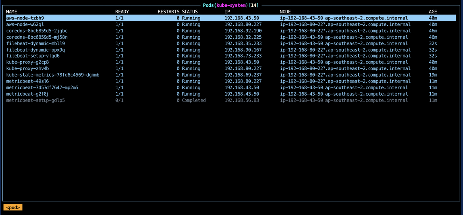
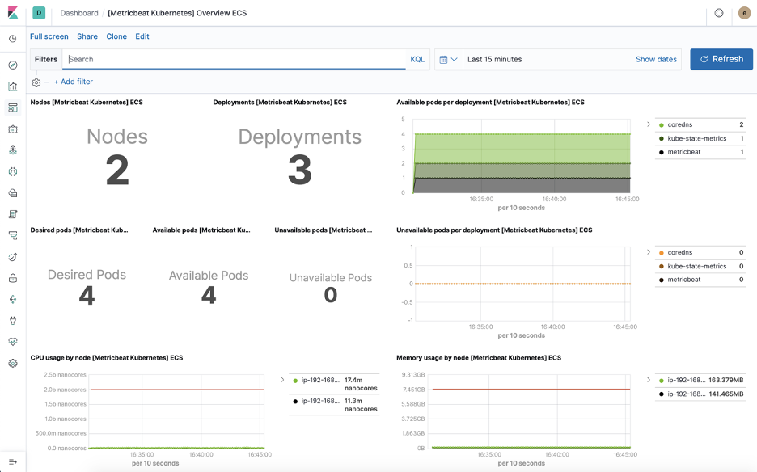
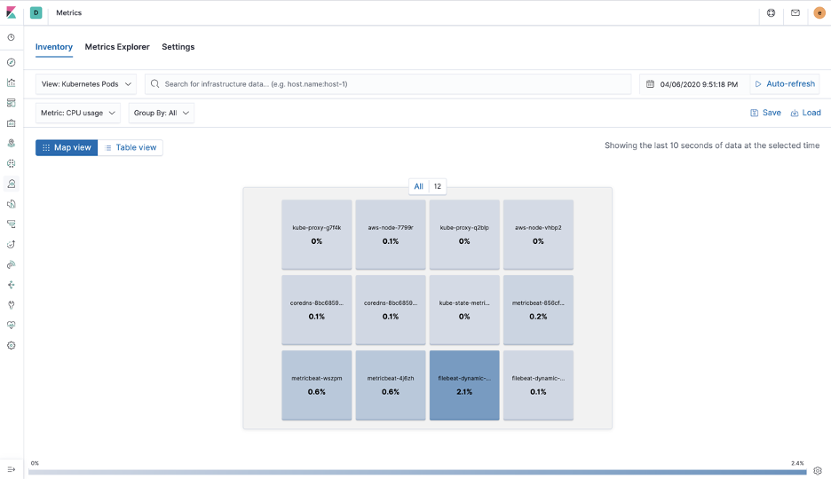
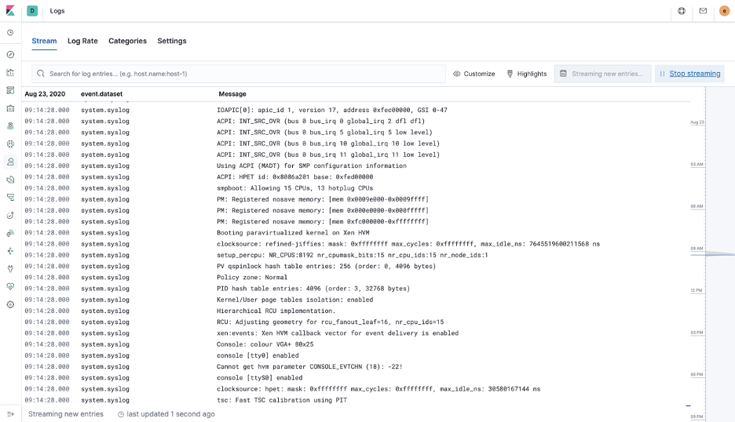

# Monitoring EKS using the Elastic Stack

This example is intended to be used with [this blog post](https://placeholder)

The main artifacts are:
* [`filebeat-kubernetes.yaml`](beats/filebeat-kubernetes.yaml)
* [`metricbeat-kubernetes.yaml`](beats/metricbeat-kubernetes.yaml)

### What we are monitoring:
The AWS account
Kubernetes hosts 
Docker containers
Kubernetes cluster

### Prerequisites
* Elastic cloud account or cluster
* AWS account
* [`aws-cli`](https://aws.amazon.com/cli/)
* [`eksctl`](https://eksctl.io/)

### Steps

* Create AWS resources
```
# Create EKS cluster
eksctl create cluster --name my-cluster --version 1.14

# Create and configure IAM user
aws iam create-policy --policy-name MetricbeatAllMetricsets --policy-document file://config/metricbeat-iam-policy.json
aws iam create-user --user-name metricbeat-aws
aws iam create-access-key --user-name metricbeat-aws
aws iam attach-user-policy --user-name metricbeat-aws --policy-arn arn:aws:iam::ACCOUNT_ID:policy/MetricbeatAllMetricsets
```

* [Create Elasticsearch deployment](https://www.elastic.co/guide/en/cloud/current/ec-create-deployment.html) using [Elastic Cloud](https://www.elastic.co/cloud/) or otherwise

```
cp secrets/secrets-example.yaml secrets/secrets.yaml
vi secrets/secrets.yaml
```

* Fill in `secrets/secrets.yaml` with base64 encoded values of the credentials

```
echo "your credential" | base64
```

Alternatively, use the script provided to generate this file for you. To do this, fill in your credentials in the following 4 files. (single line, no extra characters)
- secrets/CREDS/ELASTIC_CLOUD_ID
- secrets/CREDS/ELASTIC_CLOUD_AUTH
- secrets/CREDS/AWS_ACCESS_KEY_ID
- secrets/CREDS/AWS_ACCESS_KEY_SECRET

And then run 

```
(cd secrets && ./generate-secrets-manifest.sh)
```

* Create Kubernetes resources

```
git clone https://github.com/kubernetes/kube-state-metrics

# Deploy kube-state-metrics
kubectl apply -f kube-state-metrics/examples/standard

# Deploy your secrets
kubectl apply -f secrets/secrets.yaml

# Deploy metricbeat for kubernetes
kubectl apply -f beats/metricbeat-kubernetes.yaml

# Deploy filebeat for kubernetes
kubectl apply -f beats/filebeat-kubernetes.yaml

```

All done. You should have EKS logs and metrics data flowing into Elasticsearch.








