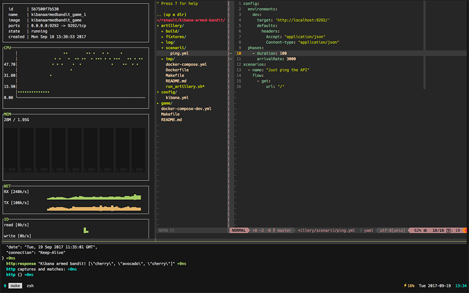

Kibana Armed Bandit
===================

**Logging** is key in every setup: having useful logs from the components in your
environment is your best tool in order to diagnosis issues and keep track of
your applications health.

Docker-based deployments are no exception to the rule. In this training we will
evaluate Kibana features, upon reaching an **E*K** stack.

This project is the workshop part of the [Kibana training](https://git.renault-digital.com/common/training/tree/master/kibana)

Dependencies
------------

- [docker](https://docs.docker.com/engine/installation/)
- [docker-compose](https://docs.docker.com/compose/install/)
- [make](https://en.wikipedia.org/wiki/Make_(software))
- [ngrok](https://ngrok.com/download) (optional)
- [your brain](https://imgur.com/gallery/tX8UN) (not optional)

### Supported Docker versions
The images have been tested on Docker 17.09.0-ce-rc1 and docker-compose 1.16.1

Installation
------------

**Docker**, the new trending containerization technique, is winning hearts with its
lightweight, portable, "build once, configure once and run anywhere" functionalities.

To run this project on your computer you only need Docker, you probably already
know this technology. In case you don't we have written a training
[here](https://git.renault-digital.com/common/training/blob/master/docker/docker-intro-part1.md).
You can find the documentation about how to install the docker engine
[here](https://docs.docker.com/engine/installation/) on the docker official website.

Everything Ok...? Let's start!

Usage
-----

**Makefiles** are a simple way to organize commands, to see this project useful
system commands run `make help`

1 - Start the testing stack

This docker-based [stack](docker-compose-dev.yml) is composed by the following components:

- simple ruby application (rack webserver)
- Elasticsearch as a single node
- Filebeat (logs shipper)
- Kibana

> Hum... I have to just run `make start` ?
>> Yeah!

So, the ruby rack based application can be reached by curl and should return a random
arrays of fruits!


If you want to learn how to start an **Elasticsearch** cluster with Docker, take a look at
this [page](https://www.elastic.co/guide/en/elasticsearch/reference/current/docker.html).
The [docker-compose-dev.yml](docker-compose-dev.yml) file start Elasticsearch
as single node mode. Xpack activation is not included.

**Filebeat** will ship your logs to this Elasticsearch container. To learn more on how Filebeat
works and how to configure your `harvesters` and `prospectors` take a look at
this [page](https://www.elastic.co/guide/en/beats/filebeat/current/how-filebeat-works.html)

2 - Open your Kibana

If you use the docker compose [file](docker-compose-dev.yml) a configured container with Kibana can be
find at this URL [http://localhost:5601/](http://localhost:5601/)

You can optionally give an internet access to your local Kibana by using [Ngrok](https://ngrok.com/).
If **ngrok** is installed on your laptop and you want to share a dashboard, just run `make proxy-kibana`.

3 - Stress your application

> Now, it's time to generate traffic :)

To generate logs and stress the ruby sample application, I use [artillery](https://artillery.io/).
It's a modern load testing toolkit written in Node.js. It's easy to define
**scenarii** with the `yaml` syntax. If you’re new to Artillery, [Getting Started](https://artillery.io/docs/getting-started)
is a good place to start, followed by an overview of [how Artillery works](https://artillery.io/docs/basic-concepts).
I wrapped all the things you need to run the load tests in the Docker containers.

```
cd artillery
make build # generate an artillery container
make ping # start a very minimal ping scenario
```



More infos in the [README](artillery/README.md) and commands in the `Makefile`

4 - Create cool dashboards!

About the Elastic Stack
-----------------------
[Elastic](https://www.elastic.co/about) is the company behind the elastic stack.
It is a product portfolio of popular open source projects:

- [Kibana](https://www.elastic.co/products/kibana)
- [ElasticSearch](https://www.elastic.co/products/elasticsearch)
- [Logstash](https://www.elastic.co/products/logstash)
- [Beats](https://www.elastic.co/products/beats)
- [X-Pack](https://www.elastic.co/products/x-pack)

**Elasticsearch** is the heart of the elastic stack, it is a server using
[Lucene](https://lucene.apache.org/core/) an ultra fast search library for
indexing and retrieving data. It provides a distributed, multi-entity search
engine through a REST interface. It is a free software written in Java and
published in open source under Apache license.

It is associated with other free products, Kibana, Logstash, and now Beats which
are respectively a data viewer and **ETLs**.

Elasticsearch is a solution built to be distributed and to use **JSON** via **HTTP**
requests. This makes the search engine usable with any programming language.
It also has **facet** and **percolation** search capabilities. If you want to
know more about facet search, take a look at the very first implementation of
facet with the Berkeley's [Flamenco project](http://flamenco.berkeley.edu/).


Must-Read Sources
-----------------

- [Configuring Kibana on Docker](https://www.elastic.co/guide/en/kibana/current/_configuring_kibana_on_docker.html)
- [Install Elasticsearch with Docker](https://www.elastic.co/guide/en/elasticsearch/reference/current/docker.html)
- [Official Beats Docker images](https://github.com/elastic/beats-docker)
- [How Filebeat works](https://www.elastic.co/guide/en/beats/filebeat/current/how-filebeat-works.html)
- [Running Logstash on docker](https://www.elastic.co/guide/en/logstash/current/docker.html)
- [Rack, the ruby webserver interface](https://rack.github.io/)
- [Ruby an elegant and dynamic language](https://www.ruby-lang.org/en/)
- [Ougai a JSON log formatter for ruby](https://github.com/tilfin/ougai)

Contributing
------------

This project is a part of a collection of resources for people who want to learn
how to run and contribute to improve projects **quality** at Renault-Digital.

If you find bugs or want to improve the documentation, please feel free to
contribute!

Happy coding!

