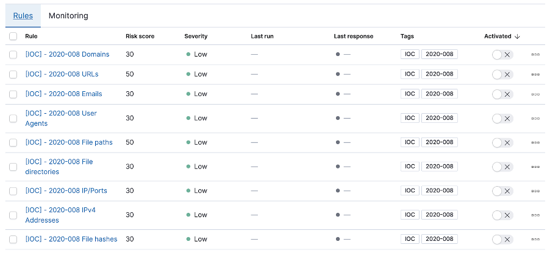

## ACSC 2020-008 Advisory IOCs for Elastic SIEM

The Australian Cyber Security Centre (ACSC) recently [published an advisory](https://www.cyber.gov.au/threats/advisory-2020-008-copy-paste-compromises-tactics-techniques-and-procedures-used-target-multiple-australian-networks) outlining tactics, techniques and procedures used against multiple Australian businesses in a recent campaign by a state based actor.

SIEM rules were created using the [list of IOCs](https://www.cyber.gov.au/sites/default/files/2020-06/ACSC-Advisory-2020-008-Copy-Paste-Compromises-Indicators-of-Compromise.csv) published by the ACSC to detect and alert on a potential attack.

IOCs often change rapidly during campaigns and should not solely be relied upon for detections. However, it can be useful to maintain a list of IOCs in case other lines of defence are bypassed by the adversary.

* Download the [`acsc-2020-008-IOCs.ndjson`](acsc-2020-008-IOCs.ndjson) file containing the SIEM detection rules from Elastic’s GitHub repository. All rules are tagged with `IOC` and `2020-008` for convenient filtering and management in the SIEM UI
* Import the rules into SIEM
* Review the field names used within the rules. The rules currently reference default ECS fields, but your field names may vary internally
* Activate rules as required

Note that the SIEM rules currently run every 60 minutes, looking back at events from the last 60 minutes. The rules currently do not run actions for every execution. If you need to act on detections, it would be a good idea to set the frequency to `Hourly` rather than on each rule execution, to reduce the amount of noise created.

[Here is a full blog post](https://www.elastic.co/blog/preventing-copy-paste-compromises-acsc-2020-008-with-elastic-security) on the campaign and Elastic Security.
