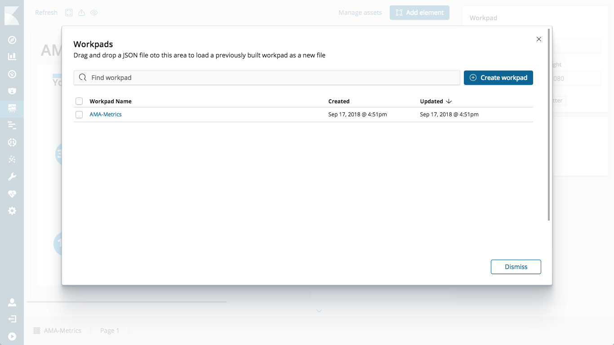

This directory contains the files necessary to recreate the AMA Metrics Canvas from Elastic{ON} 2018, and includes a sample of the metrics from the conference.

To use this data you need an Elastic Stack running, and Canvas installed on the Kibana node.  Check out [the Canvas install instructions](http://canvas.elastic.co/stories/installing.html) to see how to install the latest version of Canvas.

## To load the data

Log into Kibana, and navigate over to your DevTools.  Paste into the DevTools the contents of the `ama-responses.bulk` file, which starts like this:

```json
PUT amaresponses
{
  "mappings": {
    "doc": {
      "properties": {
        "@timestamp": {
			(...)
			
POST _bulk
{ "index" : { "_index" : "amaresponses", "_type" : "doc", "_id" : "1" } }
{"time_spent": ["15+"], "@timestamp": "2018-02-27T01:23:53.139Z", "business_group": ["Training"], "topics": ["Kibana", "Elasticsearch", "Logstash", "APM", "Swiftype", "X-Pack"], "use_case": ["Security Analytics", "Application Search", "Site Search"]}
{ "index" : { "_index" : "amaresponses", "_type" : "doc", "_id" : "2" } }
{"time_spent": ["15+"], "@timestamp": "2018-02-27T01:23:53.139Z", "business_group": ["Training"], "topics": ["Kibana", "Elasticsearch", "Logstash", "APM", "Swiftype", "X-Pack"], "use_case": ["Security Analytics", "Application Search", "Site Search"]}
			
```

Select all of the text that you pasted, then hit the little play button to load the data.

You can then paste in `POST /amaresponses/_search` and execute that to see that it now has data.

## To load the Canvas workpad(s)

There are two different canvas workpads - one (`canvas-workpad-ama-responses.json`) is the actual workpad from Elastic{ON}, while the other (`canvas-workpad-ama-responses-alt.json`) is slightly altered, handling the image repeat/fill differently.

Still in Kibana, navigate to the Canvas app (it looks like a little easel).  Click on the "workpads" on the bottom, which will pop up the workpad selector.  Here we see a tip: 

> Tip: Drag and drop a `JSON` exported workpad into this dialog to load new workpad from a file

If you already have a workpad it will look like this: 

> 

If starting from scratch, like this: 

> 

One at a time, drag and drop the canvases onto that pane, and they will upload.  Select the new workpad and the data should appear!
